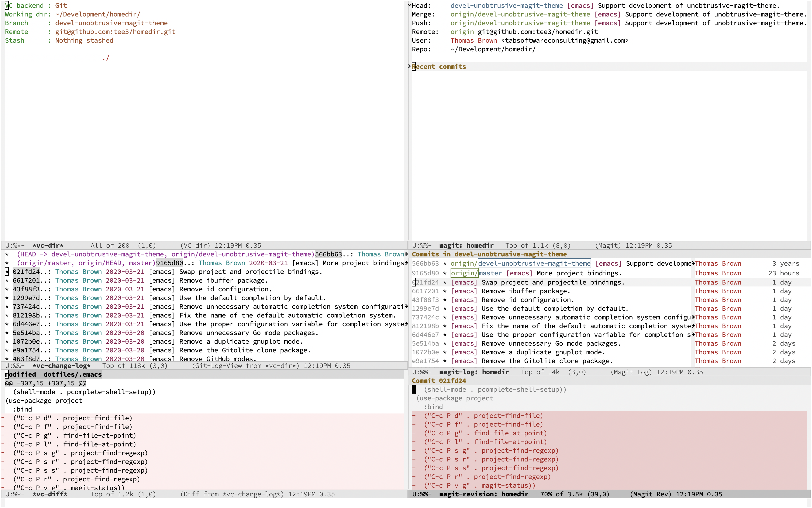
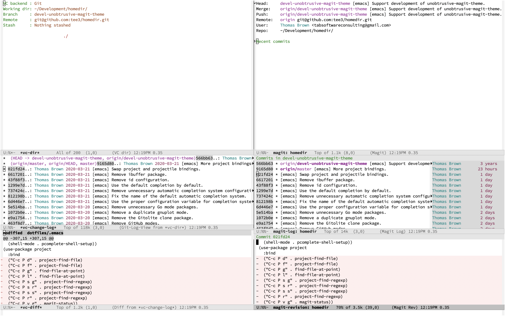
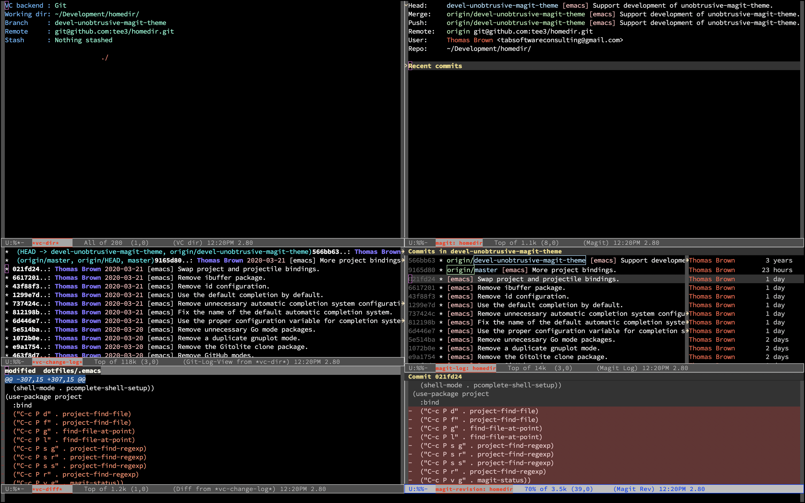
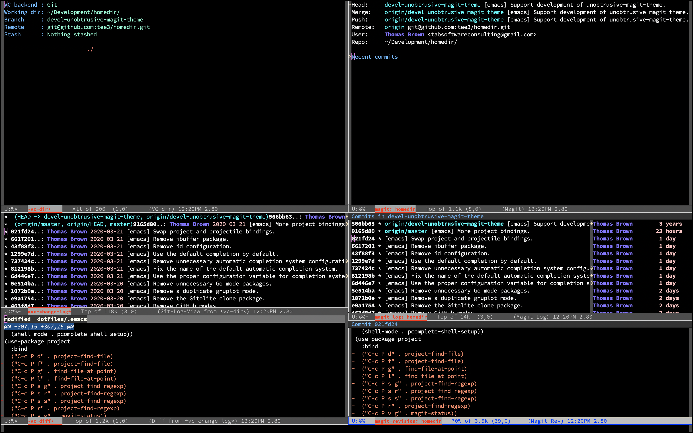
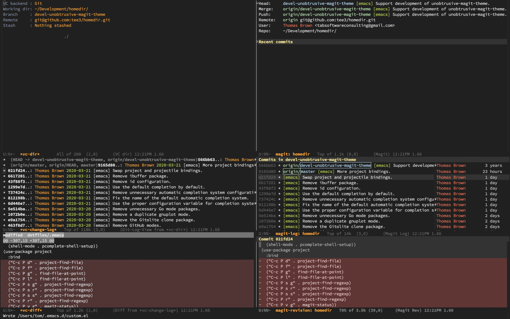
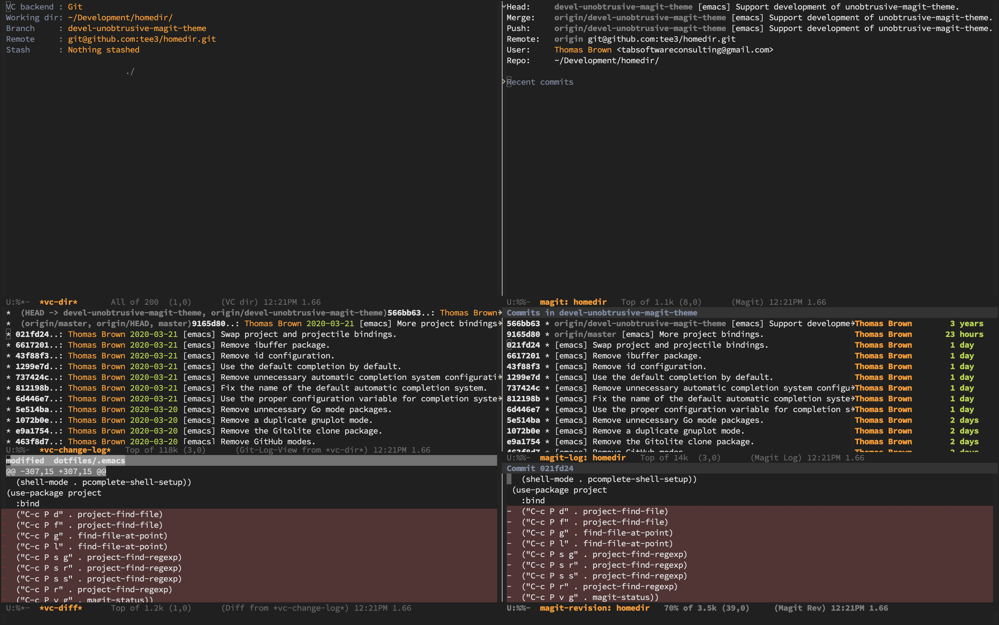

<!-- Copyright (C) 2016 by Thomas A. Brown -->

# unobtrusive-magit-theme

An Emacs theme to support Magit and related modes by inheriting from
standard Emacs faces such as those provided by Emacs VC and Diff.
This allows Magit to blend in with the rest of the theme.

NOTE: This currently only works if the theme has not defined faces for
Magit.

# Installation

## Manual

Add the path to `unobtrusive-magit-theme` to the
`custom-theme-load-path`.

```emacs-lisp
(add-to-list 'custom-theme-load-path "~/path/to/unobtrusive-magit-theme")
```

## Using `use-package`

To install automatically using `use-package`, add the following to
your Emacs initialization file.

``` emacs-lisp
(use-package unobtrusive-magit-theme
  :load-path "~/path/to/unobtrusive-magit-theme"
  :defer t)
```

See the [documentation](https://github.com/jwiegley/use-package) to
learn more about `use-package`.

# Usage

Load the desired theme, then load the `unobtrusive-magit` theme.

For example, to improve the Magit faces for the built-in `manoj-dark`
theme, run the following commands within Emacs.

```
M-x load-theme RET manoj-dark
M-x load-theme RET unobtrusive-magit
```

The `unobtrusive-magit` theme should be disabled when the desired
frame is disabled.

```
M-x disable-theme RET unobtrusive-magit
M-x disable-theme RET manoj-dark
```

# Screenshots

There are screenshots showing the changes to a theme both before and
after loading the `unobtrusive-magit` theme.  Each screenshot shows
several windows containing equivalent Emacs VC buffers on the left
side of the screen and Magit buffers on the right side of the screen.

The screenshots were generated using the system screenshot tool.

## GUI Default Theme

The default theme for the GUI Emacs has no support for Magit.

### Default



### With `unobtrusive-magit`



## GUI manoj-dark (built-in) Theme

The `manoj-dark` theme for the GUI Emacs has no support for Magit.

### Without `unobtrusive-magit`



### With `unobtrusive-magit`



## GUI mustang (via package) Theme

The `mustang` theme for the GUI Emacs has no support for Magit.

### Without `unobtrusive-magit`



### With `unobtrusive-magit`



# Acknowledgments

* FSF and GNU
* GNU Emacs
* Magit
* Inspirational Themes
  * [Chocolate](https://github.com/SavchenkoValeriy/emacs-chocolate-theme)
  * [Cyberpunk](https://github.com/n3mo/cyberpunk-theme.el)
  * [Rebecca](https://github.com/vic/rebecca-theme)

# Contributing

See [CONTRIBUTING](CONTRIBUTING.md)
